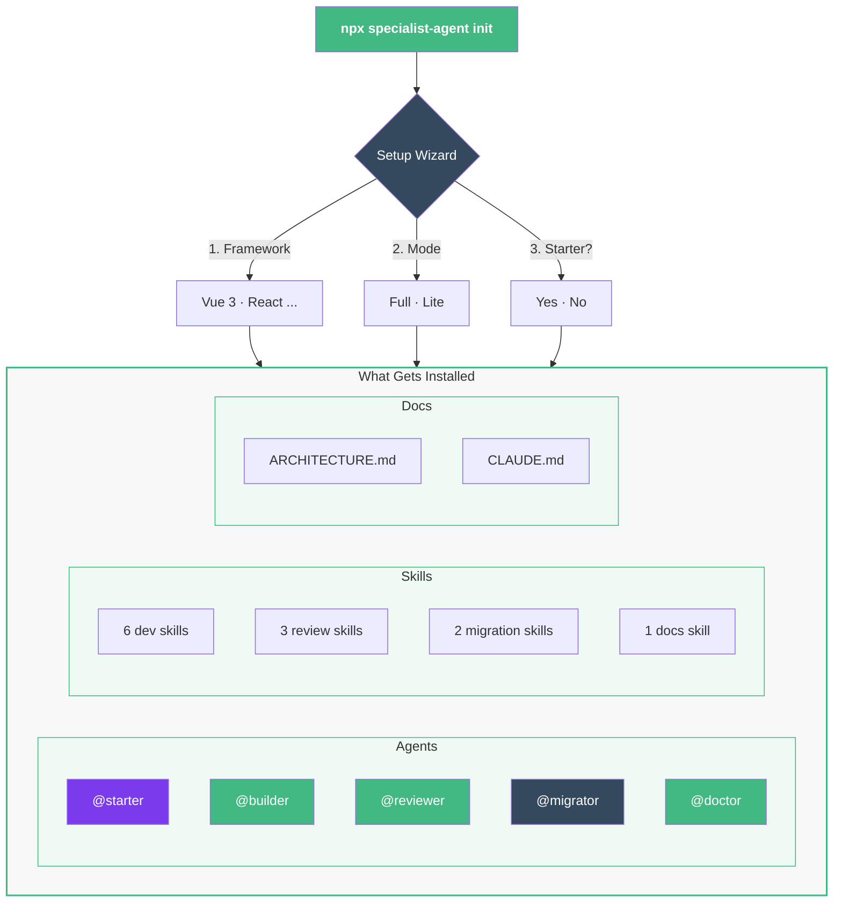

# Installation

## Prerequisites

- A project with `package.json`
- [Claude Code](https://docs.anthropic.com/en/docs/claude-code) installed

## Install

```bash
# 1. Go to your project
cd /path/to/your-project

# 2. Run the wizard
npx specialist-agent init
```

The wizard asks:
1. **Framework** — Vue 3, React (coming soon)
2. **Mode** — Full (Sonnet/Opus) or Lite (Haiku)
3. **Starter agent** — Install @starter for project creation?

## What Gets Installed



The installer copies these files into your project:

```text
your-project/
├── .claude/
│   ├── agents/              ← 5 AI subagents
│   │   ├── starter.md
│   │   ├── builder.md
│   │   ├── reviewer.md
│   │   ├── migrator.md
│   │   └── doctor.md
│   └── skills/              ← 12 skills
│       ├── dev-create-module/
│       ├── review-review/
│       ├── migration-migrate-module/
│       └── docs-onboard/
├── docs/
│   └── ARCHITECTURE.md      ← Source of truth for patterns
└── CLAUDE.md                 ← Project config for Claude
```

::: warning Non-destructive
The installer **never overwrites** existing `ARCHITECTURE.md` or `CLAUDE.md` files. If they already exist, they are skipped.
:::

## Lite Mode (Lower Cost)

For budget-conscious usage, install Lite agents that run on the **Haiku model**:

```bash
npx specialist-agent init    # select "Lite" in wizard
```

| Aspect | Full | Lite |
|--------|------|------|
| **Model** | Sonnet/Opus | Haiku |
| **Cost** | ~5-25k tokens | ~2-10k tokens |
| **Validation** | tsc + build + vitest | Skipped |
| **First action** | Reads ARCHITECTURE.md | Rules inline |

Same agent names, same capabilities — just cheaper per invocation.

## Verify Installation

```bash
# Open Claude Code
claude

# Check agents are loaded
/agents

# Try a quick skill
/review-check-architecture
```

You should see your installed agents listed (e.g., `@starter`, `@builder`, `@reviewer`, `@migrator`, `@doctor`, plus specialist agents if installed).

## Optional: Context7 MCP

For up-to-date library documentation when asking Claude about APIs, you can add the [Context7 MCP server](https://github.com/upstash/context7). This benefits you as a developer — agents work fully without it:

```json
// ~/.claude/mcp.json
{
  "mcpServers": {
    "context7": {
      "command": "npx",
      "args": ["-y", "@upstash/context7-mcp@latest"]
    }
  }
}
```

## Next Steps

- [Quick Start](/guide/quick-start) — Build something with the agents
- [Architecture Overview](/guide/architecture) — Understand the patterns
- [Customization](/customization/creating-agents) — Adapt the kit to your project
