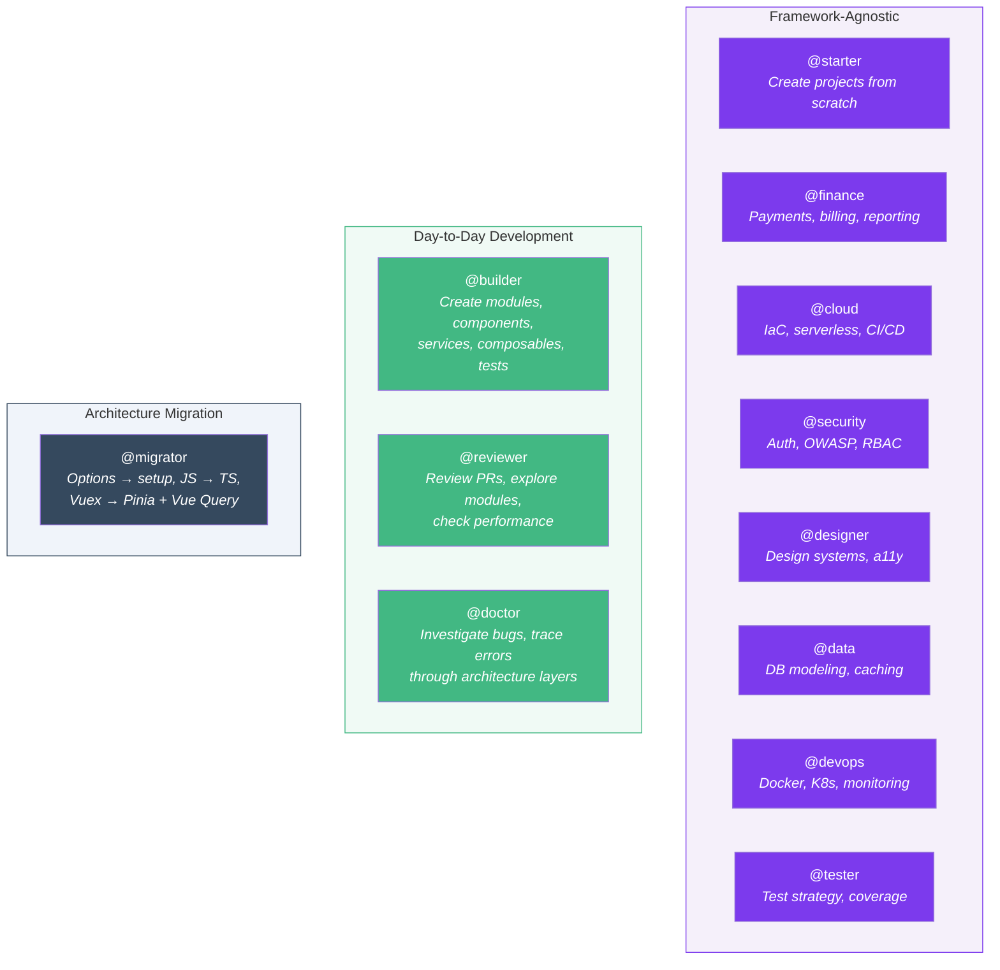
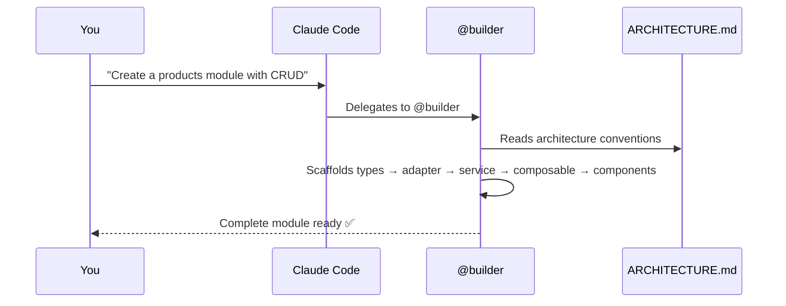

# Introduction

## What is Specialist Agent?

Specialist Agent is an open-source collection of **agents**, **skills**, and **architectural conventions** designed for [Claude Code](https://docs.anthropic.com/en/docs/claude-code).

Once installed in your project, Claude automatically follows your architecture rules, generates consistent code, reviews PRs, migrates legacy code, and more.

**It's not a library or framework** — it's a set of markdown instructions that make Claude Code work like a senior developer who knows your codebase conventions.

## Framework Packs

Specialist Agent organizes agents and patterns into **framework packs**. Each pack provides stack-specific agents, skills, and architecture patterns:

| Pack | Stack |
|------|-------|
| **Vue 3** | Vue 3 + TypeScript + Pinia + TanStack Vue Query |
| **React** | React 18 + TypeScript + Zustand + TanStack React Query |
| **Next.js** | Next.js 14+ (App Router) + TypeScript + Zustand + Server Components |
| **SvelteKit** | SvelteKit 2 + TypeScript + Svelte stores + load functions |

## What You Get

| Feature | Count | Description |
|---------|-------|-------------|
| AI Agents | 12 | Starter, builder, reviewer, migrator, doctor + 7 specialists |
| Lite Agents | 12 | Same agents running on Haiku model (lower cost) |
| Skills | 12 | Shortcuts to scaffold and validate code |
| Architecture Guide | 1 | Comprehensive source of truth for all patterns |

## Your AI Team

Specialist Agent has **12 agents** organized by scenario:

| Scenario | Agents | When |
|----------|--------|------|
| **Project Creation** | `@starter` | Starting a new project from scratch |
| **Day-to-Day** | `@builder` `@reviewer` `@doctor` | Building features, reviewing code, fixing bugs |
| **Migration** | `@migrator` `@reviewer` | Modernizing legacy projects to the target architecture |
| **Specialists** | `@finance` `@cloud` `@security` `@designer` `@data` `@devops` `@tester` | Domain-specific expertise across any framework |

## Target Stack (Vue Pack)

The Vue pack is designed for projects using:

- Vue 3 + `<script setup lang="ts">`
- Pinia (client state) + TanStack Vue Query (server state)
- Vite + TypeScript (strict) + Zod
- Vue Router 4
- Vitest + @vue/test-utils

::: tip Flexible
You can adapt the patterns to your own stack by editing `docs/ARCHITECTURE.md`. All agents read this file before acting.
:::

## How It Works

1. **Install** Specialist Agent into your project (copies markdown files)
2. **Open Claude Code** in your project
3. **Use agents and skills** — Claude automatically delegates to the right specialist

## Next Steps

- [Installation](/guide/installation) — Set up Specialist Agent in your project
- [Quick Start](/guide/quick-start) — Build a real feature step by step
- [Architecture Overview](/guide/architecture) — Understand the patterns

## Tutorials

### Day-to-Day Development

Use `@builder`, `@reviewer`, and `@doctor` for everyday work:

- [Build a CRUD Module](/tutorials/crud-module) — Complete Orders module from scratch
- [Create a Service Layer](/tutorials/service-layer) — Integrate a new API endpoint
- [Build Forms with Validation](/tutorials/forms) — Zod + useMutation + error handling
- [Pagination + Filters](/tutorials/pagination-filters) — Lists with search, filters, and pagination

### Architecture Migration

Use `@migrator` and `@reviewer` to modernize legacy projects:

- [Migrate Your Project](/tutorials/migrate-project) — 6-phase guide from legacy to target architecture
