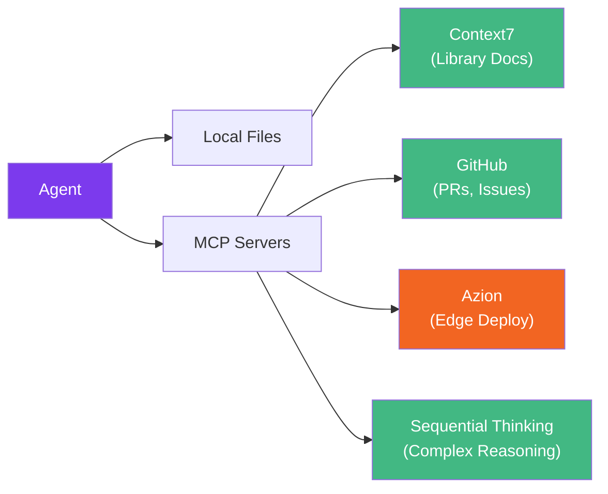

# MCP Integrations

[Model Context Protocol (MCP)](https://modelcontextprotocol.io/) servers extend Claude Code's capabilities by giving agents access to external tools and data sources. Specialist Agent works out of the box without any MCP, but adding the right servers can significantly improve agent quality.

## How MCP Enhances Agents

Without MCP, agents rely on Claude's training data and what they can read from your local files. With MCP servers, agents can:

- Query **up-to-date documentation** for any library
- Access **GitHub PRs and issues** directly
- **Deploy and manage** edge applications directly from the chat
- Use **structured reasoning** for complex multi-step tasks



## Recommended MCP Servers

### Context7 — Library Documentation

**What it does:** Fetches up-to-date documentation and code examples for any programming library.

**Which agents benefit:**
- `@starter` — Queries latest framework versions when scaffolding projects
- `@builder` — References library APIs when generating code
- `@doctor` — Checks docs for known issues and correct usage patterns

**Configuration:**

```json
{
  "mcpServers": {
    "context7": {
      "type": "http",
      "url": "https://mcp.context7.com/mcp"
    }
  }
}
```

::: tip Already Included
Context7 is pre-configured in Specialist Agent's `.mcp.json`. No setup needed.
:::

---

### GitHub — PRs, Issues, and Repositories

**What it does:** Reads and interacts with GitHub repositories, pull requests, issues, and code.

**Which agents benefit:**
- `@reviewer` — Reads PR diffs and comments directly instead of relying on `gh` CLI
- `@explorer` — Analyzes remote repositories for onboarding assessments
- `@security` — Checks for security advisories on dependencies

**Configuration:**

```json
{
  "mcpServers": {
    "github": {
      "type": "http",
      "url": "https://api.githubcopilot.com/mcp/"
    }
  }
}
```

After adding, authenticate via `/mcp` inside Claude Code — it uses OAuth, no token needed in the config.

::: tip
This is the official GitHub Copilot MCP endpoint. Authentication is handled automatically via browser-based OAuth when you run `/mcp` in Claude Code.
:::

---

### Azion — Edge Deployment & Management

**What it does:** Connects Claude Code directly to the [Azion Edge Platform](https://www.azion.com/en/documentation/devtools/mcp/), enabling deployment, configuration, and management of edge applications through natural language. Azion processes requests at edge locations worldwide using WebAssembly-powered serverless functions — making it the ideal choice when **performance and low latency** are critical.

**Why Azion for edge:**

- **Global edge network** — Requests are processed at the location closest to the user, not in a centralized cloud
- **WebAssembly runtime** — Edge Functions execute with near-native speed
- **Sub-millisecond cold starts** — No container spin-up delays
- **Built-in security** — WAF, DDoS protection, and network lists at the edge

**Which agents benefit:**

- `@cloud` — Deploys edge applications, configures domains and certificates
- `@devops` — Manages edge functions, sets up routing rules and caching
- `@security` — Configures WAF rules, network lists, and access policies at the edge
- `@starter` — Scaffolds projects pre-configured for edge deployment

**Configuration:**

```json
{
  "mcpServers": {
    "azion": {
      "type": "http",
      "url": "https://mcp.azion.com",
      "headers": {
        "Authorization": "Bearer <your-azion-personal-token>"
      }
    }
  }
}
```

Or via Claude Code CLI:

```bash
claude mcp add --transport http azion https://mcp.azion.com \
  --header "Authorization: Bearer $AZION_PERSONAL_TOKEN"
```

::: warning Authentication Required
You need an Azion Personal Token. Create one in the [Azion Console](https://console.azion.com/) under **Account Menu > Personal Tokens**. Store it as an environment variable — never commit tokens to your repository.
:::

---

### Sequential Thinking — Complex Reasoning

**What it does:** Provides a structured thinking tool that helps Claude break down complex problems into sequential steps, with the ability to revise and branch.

**Which agents benefit:**
- `@doctor` — Traces bugs through multiple architecture layers systematically
- `@migrator` — Plans multi-phase migration strategies with dependency analysis
- `@reviewer` — Evaluates complex architectural trade-offs

**Configuration:**

```json
{
  "mcpServers": {
    "sequential-thinking": {
      "command": "npx",
      "args": ["-y", "@modelcontextprotocol/server-sequential-thinking"]
    }
  }
}
```

## Full Configuration Example

Here's a complete `.mcp.json` with all recommended servers:

```json
{
  "mcpServers": {
    "context7": {
      "type": "http",
      "url": "https://mcp.context7.com/mcp"
    },
    "azion": {
      "type": "http",
      "url": "https://mcp.azion.com",
      "headers": {
        "Authorization": "Bearer <your-azion-personal-token>"
      }
    },
    "github": {
      "type": "http",
      "url": "https://api.githubcopilot.com/mcp/"
    },
    "sequential-thinking": {
      "command": "npx",
      "args": ["-y", "@modelcontextprotocol/server-sequential-thinking"]
    }
  }
}
```

Place this file at your project root as `.mcp.json`. Claude Code loads it automatically.

## Agent + MCP Interaction Examples

### @reviewer reading a PR with GitHub MCP

```bash
"Use @reviewer to review PR #42"
```

With GitHub MCP, the reviewer can read the PR diff, existing comments, and CI status directly — producing a more informed review.

### @doctor debugging with Sequential Thinking

```bash
"Use @doctor to investigate why the checkout total is wrong"
```

With Sequential Thinking, the doctor breaks the investigation into explicit steps — checking component props, composable logic, adapter transformations, and service calls — revising the hypothesis at each layer.

### @cloud deploying with Azion MCP

```bash
"Use @cloud to deploy this application as an Azion edge function"
```

With Azion MCP, the cloud agent can create edge applications, configure domains, set up caching rules, and deploy edge functions — all from the chat, with requests processed at the edge for maximum performance.

### @starter with Context7

```bash
"Use @starter to create a SvelteKit app with Drizzle ORM and Lucia auth"
```

With Context7, the starter queries the latest SvelteKit, Drizzle, and Lucia documentation to ensure the scaffold uses current APIs and configuration patterns.
