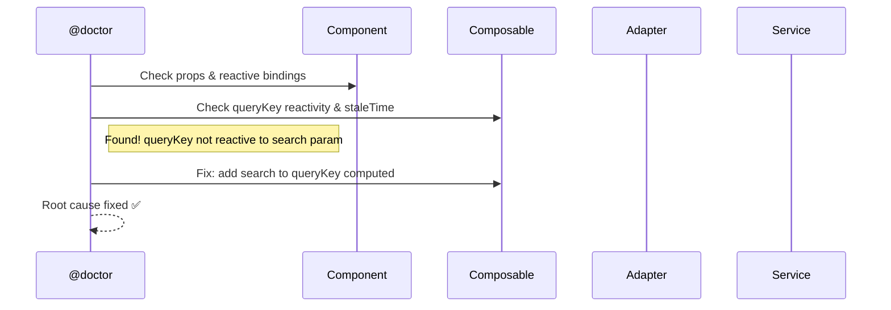

# Quick Start

After [installing](/guide/installation) Specialist Agent, open Claude Code in your project. Here are the most common workflows.


---

## 1. Start a New Project

Use `@starter` to scaffold a full-stack project from scratch — any framework, backend, and database.

```bash
"Use @starter to create a task-manager app with Vue + Express + PostgreSQL"
```

The starter wizard asks about project name, frontend/backend stack, database, auth, and structure — then scaffolds everything including Docker compose and README.

> **Learn more:** [@starter reference](/reference/agents#starter-create-projects-from-scratch)

---

## 2. Build a Feature Module

Use `@builder` to create modules, components, services, composables, or tests. It reads your `ARCHITECTURE.md` and follows all conventions automatically.

```bash
# Full module with CRUD
"Use @builder to create a products module with CRUD for /v2/products"

# Single component
"Use @builder to create a ProductCard component with name, price, and image props"

# Service layer only
"Use @builder to create the service layer for /v3/orders"
```

Generated structure:

```text
src/modules/products/
├── types/           ← API types + app contracts
├── adapters/        ← API ↔ App transformation
├── services/        ← Pure HTTP calls
├── composables/     ← useProductsList, useProductDetail
├── components/      ← ProductsTable, ProductForm, ProductCard
├── views/           ← ProductsView
└── index.ts         ← Barrel export
```

> **Learn more:** [Build a CRUD Module](/tutorials/crud-module) · [Create a Service Layer](/tutorials/service-layer)

---

## 3. Review Before PR

Use `@reviewer` to validate code against your architecture before merging.

```bash
# Full review with automated checks
"Use @reviewer to review the products module"

# Quick architecture check
/review-check-architecture products
```

Output example:

```text
## Review — src/modules/products/

### Auto: tsc ✅ | ESLint ✅ | Build ✅ | Tests ✅

### 🟢 Compliant
  - services/products-service.ts: HTTP only, no try/catch ✅
  - adapters/products-adapter.ts: Pure functions, bidirectional ✅

## Verdict: ✅ Approved
```

> **Learn more:** [@reviewer reference](/reference/agents#reviewer-review-analyze)

---

## 4. Debug an Issue

Use `@doctor` to trace bugs through architecture layers — from Component down to API.

```bash
"Use @doctor to investigate why products aren't loading after search"
```



> **Learn more:** [@doctor reference](/reference/agents#doctor-investigate-bugs)

---

## 5. Migrate Legacy Code

Use `@migrator` to convert Options API to script setup, JS to TS, or modernize full modules in 6 phases.

```bash
# Single component
"Use @migrator to convert OldProductsPage.vue to script setup"

# Full module (6 phases with approval gates)
"Use @migrator to migrate src/legacy/billing/ to the new architecture"
```

Before → After:

```vue
<!-- Before: Options API -->
<script>
export default {
  data() { return { products: [], loading: false } },
  methods: { async fetchProducts() { ... } },
  mounted() { this.fetchProducts() }
}
</script>
```

```vue
<!-- After: Script Setup + Composable -->
<script setup lang="ts">
import { useProductsList } from '../composables/useProductsList'

const { items, isLoading } = useProductsList()
</script>
```

> **Learn more:** [Migrate Your Project](/tutorials/migrate-project)

---

## Quick Skills Reference

Skills are shortcuts you invoke with `/skill-name`:

| Skill | What it does |
|-------|--------------|
| `/dev-create-module [name]` | Full module scaffold |
| `/dev-create-component [name]` | Component with script setup |
| `/dev-create-service [resource]` | Types + adapter + service |
| `/dev-create-composable [name]` | Composable with Vue Query |
| `/dev-create-test [file]` | Tests for any file |
| `/dev-generate-types [endpoint]` | Types from endpoint/JSON |
| `/review-review [scope]` | Full code review |
| `/review-check-architecture [module]` | Architecture conformance |
| `/review-fix-violations [module]` | Auto-fix violations |
| `/migration-migrate-component [file]` | Options → setup |
| `/migration-migrate-module [path]` | Full module migration |
| `/docs-onboard [module]` | 2-minute module overview |

> **Learn more:** [Skills Reference](/reference/skills)

---

## What's Next

- [Architecture Overview](/guide/architecture) — Understand the patterns your code follows
- [Layers](/guide/layers) — Deep dive into Service, Adapter, Composable layers
- [Agents Reference](/reference/agents) — Detailed guide for each agent
- [Skills Reference](/reference/skills) — All available skills
- [Build Forms with Validation](/tutorials/forms) — Zod + useMutation + error handling
- [Pagination + Filters](/tutorials/pagination-filters) — Lists with search, filters, and pagination
