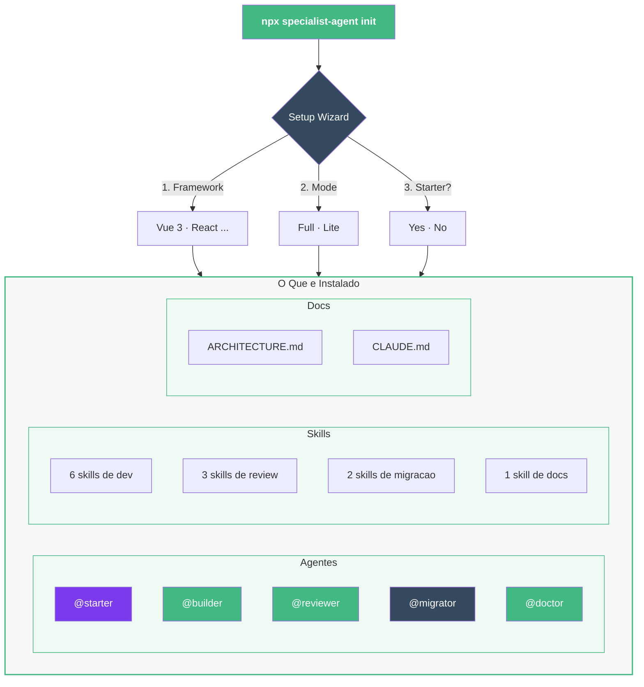

# Instalacao

## Pre-requisitos

- Um projeto com `package.json`
- [Claude Code](https://docs.anthropic.com/en/docs/claude-code) instalado

## Instalar

```bash
# 1. Va ate seu projeto
cd /path/to/your-project

# 2. Execute o assistente
npx specialist-agent init
```

O assistente pergunta:
1. **Framework** — Vue 3, React (em breve)
2. **Modo** — Full (Sonnet/Opus) ou Lite (Haiku)
3. **Agente starter** — Instalar @starter para criacao de projetos?

## O Que e Instalado



O instalador copia estes arquivos para o seu projeto:

```text
your-project/
├── .claude/
│   ├── agents/              ← 5 subagentes de IA
│   │   ├── starter.md
│   │   ├── builder.md
│   │   ├── reviewer.md
│   │   ├── migrator.md
│   │   └── doctor.md
│   └── skills/              ← 12 skills
│       ├── dev-create-module/
│       ├── review-review/
│       ├── migration-migrate-module/
│       └── docs-onboard/
├── docs/
│   └── ARCHITECTURE.md      ← Fonte de verdade para padroes
└── CLAUDE.md                 ← Configuracao do projeto para o Claude
```

::: warning Nao-destrutivo
O instalador **nunca sobrescreve** arquivos `ARCHITECTURE.md` ou `CLAUDE.md` existentes. Se eles ja existirem, serao ignorados.
:::

## Modo Lite (Custo Menor)

Para uso com orcamento reduzido, instale agentes Lite que rodam no **modelo Haiku**:

```bash
npx specialist-agent init    # selecione "Lite" no assistente
```

| Aspecto | Full | Lite |
|---------|------|------|
| **Modelo** | Sonnet/Opus | Haiku |
| **Custo** | ~5-25k tokens | ~2-10k tokens |
| **Validacao** | tsc + build + vitest | Ignorada |
| **Primeira acao** | Le ARCHITECTURE.md | Regras inline |

Mesmos nomes de agentes, mesmas capacidades — apenas mais barato por invocacao.

## Verificar Instalacao

```bash
# Abra o Claude Code
claude

# Verifique se os agentes foram carregados
/agents

# Teste uma skill rapida
/review-check-architecture
```

Voce devera ver seus agentes instalados (ex: `@starter`, `@builder`, `@reviewer`, `@migrator`, `@doctor`, alem dos agentes especialistas se instalados).

## Recomendado: Context7 MCP

Para resultados ainda melhores, adicione o [servidor MCP Context7](https://github.com/upstash/context7) para dar ao Claude acesso em tempo real a documentacao do Vue 3, Pinia e TanStack Query:

```json
// ~/.claude/mcp.json
{
  "mcpServers": {
    "context7": {
      "command": "npx",
      "args": ["-y", "@upstash/context7-mcp@latest"]
    }
  }
}
```

## Proximos Passos

- [Inicio Rapido](/pt-BR/guide/quick-start) — Construa algo com os agentes
- [Visao Geral da Arquitetura](/pt-BR/guide/architecture) — Entenda os padroes
- [Personalizacao](/customization/creating-agents) — Adapte o kit ao seu projeto
