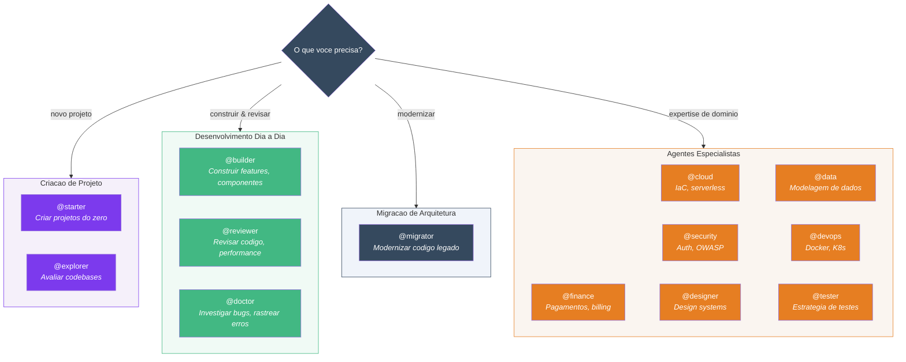
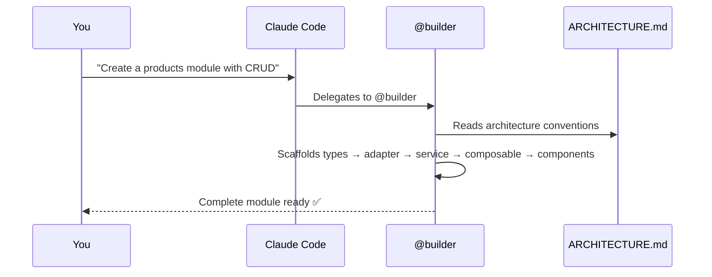

# Introducao

## O que e o Specialist Agent?

Specialist Agent e uma colecao open-source de **agentes**, **skills** e **convencoes arquiteturais** projetada para o [Claude Code](https://docs.anthropic.com/en/docs/claude-code).

Uma vez instalado no seu projeto, o Claude segue automaticamente as regras da sua arquitetura, gera codigo consistente, revisa PRs, migra codigo legado e muito mais.

**Nao e uma biblioteca ou framework** — e um conjunto de instrucoes em markdown que fazem o Claude Code trabalhar como um desenvolvedor senior que conhece as convencoes do seu codebase.

## Framework Packs

O Specialist Agent organiza agentes e padroes em **framework packs**. Cada pack fornece agentes, skills e padroes de arquitetura especificos para a stack:

| Pack | Stack |
|------|-------|
| **Vue 3** | Vue 3 + TypeScript + Pinia + TanStack Vue Query |
| **React** | React 18 + TypeScript + Zustand + TanStack React Query |
| **Next.js** | Next.js 14+ (App Router) + TypeScript + Zustand + Server Components |
| **SvelteKit** | SvelteKit 2 + TypeScript + Svelte stores + load functions |

## O Que Voce Recebe

| Recurso | Quantidade | Descricao |
|---------|------------|-----------|
| Agentes de IA | 13 | Starter, explorer, builder, reviewer, migrator, doctor + 7 especialistas |
| Agentes Lite | 13 | Mesmos agentes rodando no modelo Haiku (custo menor) |
| Skills | 12 | Atalhos para gerar e validar codigo |
| Guia de Arquitetura | 1 | Fonte de verdade abrangente para todos os padroes |

## Seu Time de IA

O Specialist Agent possui **13 agentes** organizados por cenario:

| Cenario | Agentes | Quando |
|---------|---------|--------|
| **Criacao de Projeto** | `@starter` `@explorer` | Iniciando um novo projeto ou avaliando um codebase existente |
| **Dia a Dia** | `@builder` `@reviewer` `@doctor` | Construindo funcionalidades, revisando codigo, corrigindo bugs |
| **Migracao** | `@migrator` `@reviewer` | Modernizando projetos legados para a arquitetura alvo |
| **Especialistas** | `@finance` `@cloud` `@security` `@designer` `@data` `@devops` `@tester` | Expertise especifica de dominio em qualquer framework |

## Stack Alvo (Vue Pack)

O Vue pack e projetado para projetos que utilizam:

- Vue 3 + `<script setup lang="ts">`
- Pinia (estado do cliente) + TanStack Vue Query (estado do servidor)
- Vite + TypeScript (strict) + Zod
- Vue Router 4
- Vitest + @vue/test-utils

::: tip Flexivel
Voce pode adaptar os padroes para sua propria stack editando `docs/ARCHITECTURE.md`. Todos os agentes leem este arquivo antes de agir.
:::

## Como Funciona

1. **Instale** o Specialist Agent no seu projeto (copia arquivos markdown)
2. **Abra o Claude Code** no seu projeto
3. **Use agentes e skills** — o Claude delega automaticamente para o especialista certo

## Proximos Passos

- [Instalacao](/pt-BR/guide/installation) — Configure o Specialist Agent no seu projeto
- [Inicio Rapido](/pt-BR/guide/quick-start) — Construa uma funcionalidade real passo a passo
- [Visao Geral da Arquitetura](/pt-BR/guide/architecture) — Entenda os padroes

## Tutoriais

### Desenvolvimento Dia a Dia

Use `@builder`, `@reviewer` e `@doctor` para o trabalho cotidiano:

- [Construir um Modulo CRUD](/pt-BR/tutorials/crud-module) — Modulo completo de Pedidos do zero
- [Criar uma Camada de Servico](/pt-BR/tutorials/service-layer) — Integrar um novo endpoint de API
- [Construir Formularios com Validacao](/pt-BR/tutorials/forms) — Zod + useMutation + tratamento de erros
- [Paginacao + Filtros](/pt-BR/tutorials/pagination-filters) — Listas com busca, filtros e paginacao

### Migracao de Arquitetura

Use `@migrator` e `@reviewer` para modernizar projetos legados:

- [Migre Seu Projeto](/pt-BR/tutorials/migrate-project) — Guia de 6 fases de legado para a arquitetura alvo
