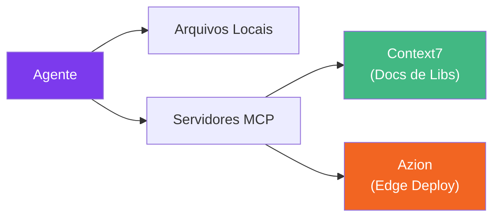

# Integracoes MCP

Servidores [Model Context Protocol (MCP)](https://modelcontextprotocol.io/) estendem as capacidades do Claude Code dando acesso a ferramentas e fontes de dados externas. **O Specialist Agent funciona completamente sem nenhum MCP** - todos os agentes operam usando arquivos locais e ferramentas nativas. MCPs sao melhorias opcionais.

## O que os MCPs Adicionam

| MCP | O que faz | Quem se beneficia |
|-----|-----------|-------------------|
| **Context7** | Busca documentacao atualizada de bibliotecas | Voce (o dev) ao perguntar sobre APIs |
| **Azion** | Gera configs de edge, faz deploy de sites estaticos | Agentes `@starter` e `@cloud` (Edge Mode) |



---

## Context7 - Documentacao de Bibliotecas

**O que faz:** Busca documentacao atualizada e exemplos de codigo para qualquer biblioteca (Vue 3, React, Pinia, TanStack Query, etc.).

**Quem se beneficia:** Principalmente **voce, o desenvolvedor**. Quando voce pergunta ao Claude Code sobre uma API de biblioteca, o Context7 fornece docs atuais em vez de depender dos dados de treinamento. Os agentes nao consultam o Context7 automaticamente - eles seguem o `ARCHITECTURE.md` do seu projeto e convencoes locais.

**Configuracao:**

```json
{
  "mcpServers": {
    "context7": {
      "type": "http",
      "url": "https://mcp.context7.com/mcp"
    }
  }
}
```

::: tip Ja Incluido
O Context7 vem pre-configurado no `.mcp.json` do Specialist Agent. Nenhuma configuracao necessaria.
:::

---

## Azion - Deploy e Configuracao na Edge

**O que faz:** Conecta o Claude Code a [Plataforma Edge da Azion](https://www.azion.com/en/documentation/devtools/mcp/), dando aos agentes acesso a documentacao, exemplos de codigo, comandos CLI, specs de API, configs Terraform e uma ferramenta de deploy de sites estaticos.

**Quais agentes usam:**

- `@starter` - Apos o scaffold, pode gerar configs de edge Azion e fazer deploy de sites estaticos
- `@cloud` - O Edge Mode usa as ferramentas do Azion MCP para gerar configs de rules engine, recursos Terraform e queries de observabilidade

### Ferramentas MCP Disponiveis

O Azion MCP expoe **9 ferramentas** - 7 de busca/geracao e 1 de deploy:

| Ferramenta | Categoria | O que faz |
|------------|-----------|-----------|
| `search_azion_docs_and_site` | Busca | Busca full-text na documentacao Azion |
| `search_azion_code_samples` | Busca | Exemplos de codigo para edge functions e frameworks |
| `search_azion_cli_commands` | Busca | Sintaxe e uso do CLI para qualquer operacao |
| `search_azion_api_v3_commands` | Busca | Endpoints, payloads e exemplos da API v3 |
| `search_azion_api_v4_commands` | Busca | Endpoints da API v4 (mais recente) |
| `search_azion_terraform` | Busca | Recursos do provider Terraform e exemplos HCL |
| `create_rules_engine` | Gerador | Gera configs de Rules Engine (cache, routing, redirects) |
| `create_graphql_query` | Gerador | Constroi queries GraphQL para analytics e observabilidade |
| `deploy_azion_static_site` | Deploy | Faz deploy de site estatico na Azion Edge |

::: info Como funciona na pratica
Para **sites estaticos** (output SSG de Vite, Nuxt, Next.js, SvelteKit), o agente pode fazer deploy direto via `deploy_azion_static_site`.

Para **apps dinamicos** (edge functions, SSR), o agente gera o `azion.config.js`, comandos CLI e configs de infraestrutura corretos - voce executa `azion deploy` manualmente.
:::

**Configuracao:**

```json
{
  "mcpServers": {
    "azion": {
      "type": "http",
      "url": "https://mcp.azion.com",
      "headers": {
        "Authorization": "Bearer <your-azion-personal-token>"
      }
    }
  }
}
```

Ou via Claude Code CLI:

```bash
claude mcp add --transport http azion https://mcp.azion.com \
  --header "Authorization: Bearer $AZION_PERSONAL_TOKEN"
```

::: warning Autenticacao Necessaria
Voce precisa de um Azion Personal Token. Crie um no [Azion Console](https://console.azion.com/) em **Menu da Conta > Personal Tokens**. Armazene como variavel de ambiente - nunca faca commit de tokens no seu repositorio.
:::

---

## Exemplo de Configuracao Completa

Aqui esta um `.mcp.json` completo com todos os servidores recomendados:

```json
{
  "mcpServers": {
    "context7": {
      "type": "http",
      "url": "https://mcp.context7.com/mcp"
    },
    "azion": {
      "type": "http",
      "url": "https://mcp.azion.com",
      "headers": {
        "Authorization": "Bearer <your-azion-personal-token>"
      }
    }
  }
}
```

Coloque este arquivo na raiz do seu projeto como `.mcp.json`. O Claude Code o carrega automaticamente.

## Exemplos de Interacao Agente + MCP

### @starter fazendo deploy na Azion Edge

```bash
"Use @starter to create a Vue 3 app and deploy it to Azion Edge"
```

Apos o scaffold, o starter pergunta onde voce quer fazer deploy. Se voce escolher Azion e o MCP estiver disponivel, ele consulta `search_azion_code_samples` para a config correta do bundler Vite, gera o `azion.config.js` e faz deploy do build estatico via `deploy_azion_static_site`.

### @cloud configurando infraestrutura edge

```bash
"Use @cloud to set up edge caching and routing rules for my API on Azion"
```

No Edge Mode, o agente cloud usa `create_rules_engine` para gerar regras de cache e routing, `search_azion_terraform` para recursos IaC e `create_graphql_query` para dashboards de observabilidade.

### Usando Context7 para consultas de bibliotecas

```bash
"How do I configure staleTime in TanStack Vue Query v5?"
```

Com o Context7 disponível, o Claude busca as docs mais recentes do TanStack Query em vez de depender dos dados de treinamento — garantindo assinaturas de API e exemplos atuais.

---

## Ferramentas Complementares

Estas não são servidores MCP incluídos no Specialist Agent, mas ferramentas externas que combinam bem com ele.

### Automação de Browser

| Ferramenta | O que Faz | Melhor Para |
| ---------- | --------- | ----------- |
| **Playwright MCP** | Testes automatizados de browser, screenshots, interação com páginas | Testes e2e do `@tester`, debug visual do `@doctor` |
| **Chrome DevTools MCP** | Logs do console, aba de rede, inspeção DOM | Debug ao vivo do `@debugger`, análise runtime do `@perf` |

Esses MCPs permitem que agentes vejam o que está acontecendo no browser — erros no console, falhas de rede, problemas de renderização — sem você precisar copiar e colar logs.

**Configuração do Playwright MCP:**

```json
{
  "mcpServers": {
    "playwright": {
      "command": "npx",
      "args": ["@anthropic/mcp-playwright"]
    }
  }
}
```

### Prompts por Voz

Ferramentas de entrada por voz permitem descrever tarefas verbalmente em vez de digitar prompts longos:

| Ferramenta | Plataforma | Como Ajuda |
| ---------- | ---------- | ---------- |
| **Wispr Flow** | macOS | Dite prompts complexos naturalmente — útil com entrevistas do `@analyst` |
| **SuperWhisper** | macOS | Voz-para-texto offline com vocabulário customizado |
| **Claude Voice Mode** | Nativo | Comando `/voice` no Claude Code |

Voz é especialmente produtivo para sessões de brainstorming com `/brainstorm` e entrevistas de requisitos com `@analyst`.

### Multiplexação de Terminal

Para workflows paralelos de agentes, um multiplexador de terminal permite rodar múltiplas sessões do Claude Code lado a lado:

| Ferramenta | O que Faz |
| ---------- | --------- |
| **tmux** | Divide o terminal em painéis, cada um rodando uma sessão do Claude Code |
| **iTerm2** | Terminal macOS com painéis divididos nativos e gerenciamento de sessão |
| **Ghostty** | Terminal rápido com GPU e suporte a divisão |
| **Windows Terminal** | Terminal nativo do Windows com suporte a abas/painéis |

Isso combina bem com workflows do `@orchestrator` — rode o orquestrador em um painel e acompanhe a atividade dos subagentes nos outros.
