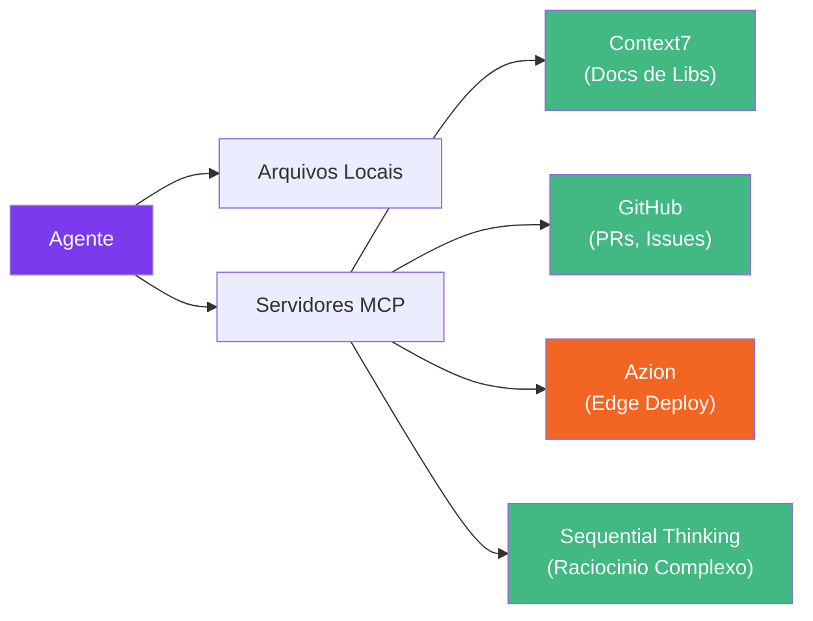

# Integracoes MCP

Servidores [Model Context Protocol (MCP)](https://modelcontextprotocol.io/) estendem as capacidades do Claude Code dando aos agentes acesso a ferramentas e fontes de dados externas. O Specialist Agent funciona sem nenhum MCP, mas adicionar os servidores certos pode melhorar significativamente a qualidade dos agentes.

## Como o MCP Melhora os Agentes

Sem MCP, os agentes dependem dos dados de treinamento do Claude e do que conseguem ler dos seus arquivos locais. Com servidores MCP, os agentes podem:

- Consultar **documentacao atualizada** de qualquer biblioteca
- Acessar **PRs e issues do GitHub** diretamente
- **Fazer deploy e gerenciar** aplicacoes edge diretamente do chat
- Usar **raciocinio estruturado** para tarefas complexas de multiplas etapas



## Servidores MCP Recomendados

### Context7 — Documentacao de Bibliotecas

**O que faz:** Busca documentacao atualizada e exemplos de codigo para qualquer biblioteca de programacao.

**Quais agentes se beneficiam:**

- `@starter` — Consulta versoes mais recentes de frameworks ao criar projetos
- `@builder` — Referencia APIs de bibliotecas ao gerar codigo
- `@doctor` — Verifica docs por problemas conhecidos e padroes corretos de uso

**Configuracao:**

```json
{
  "mcpServers": {
    "context7": {
      "type": "http",
      "url": "https://mcp.context7.com/mcp"
    }
  }
}
```

::: tip Ja Incluido
O Context7 vem pre-configurado no `.mcp.json` do Specialist Agent. Nenhuma configuracao necessaria.
:::

---

### GitHub — PRs, Issues e Repositorios

**O que faz:** Le e interage com repositorios, pull requests, issues e codigo do GitHub.

**Quais agentes se beneficiam:**

- `@reviewer` — Le diffs e comentarios de PRs diretamente em vez de depender do `gh` CLI
- `@explorer` — Analisa repositorios remotos para avaliacoes de onboarding
- `@security` — Verifica advisories de seguranca em dependencias

**Configuracao:**

```json
{
  "mcpServers": {
    "github": {
      "command": "npx",
      "args": ["-y", "@modelcontextprotocol/server-github"],
      "env": {
        "GITHUB_PERSONAL_ACCESS_TOKEN": "<your-token>"
      }
    }
  }
}
```

::: warning Autenticacao Necessaria
Voce precisa de um GitHub Personal Access Token. Crie um em [github.com/settings/tokens](https://github.com/settings/tokens) com escopo `repo`.
:::

---

### Azion — Deploy e Gerenciamento na Edge

**O que faz:** Conecta o Claude Code diretamente a [Plataforma Edge da Azion](https://www.azion.com/en/documentation/devtools/mcp/), permitindo deploy, configuracao e gerenciamento de aplicacoes edge por linguagem natural. A Azion processa requisicoes em locais de edge no mundo todo usando funcoes serverless com WebAssembly — tornando-a a escolha ideal quando **performance e baixa latencia** sao criticos.

**Por que Azion para edge:**

- **Rede global de edge** — Requisicoes sao processadas no local mais proximo do usuario, nao em uma cloud centralizada
- **Runtime WebAssembly** — Edge Functions executam com velocidade quase nativa
- **Cold starts sub-milissegundo** — Sem delays de spin-up de containers
- **Seguranca integrada** — WAF, protecao DDoS e network lists na edge

**Quais agentes se beneficiam:**

- `@cloud` — Faz deploy de aplicacoes edge, configura dominios e certificados
- `@devops` — Gerencia edge functions, configura regras de roteamento e cache
- `@security` — Configura regras WAF, network lists e politicas de acesso na edge
- `@starter` — Cria projetos pre-configurados para deploy na edge

**Configuracao:**

```json
{
  "mcpServers": {
    "azion": {
      "type": "http",
      "url": "https://mcp.azion.com",
      "headers": {
        "Authorization": "Bearer <your-azion-personal-token>"
      }
    }
  }
}
```

Ou via Claude Code CLI:

```bash
claude mcp add "azion" "https://mcp.azion.com" -t http \
  -H "Authorization: Bearer $AZION_PERSONAL_TOKEN"
```

::: warning Autenticacao Necessaria
Voce precisa de um Azion Personal Token. Crie um no [Azion Console](https://console.azion.com/) em **Menu da Conta > Personal Tokens**. Armazene como variavel de ambiente — nunca faça commit de tokens no seu repositorio.
:::

---

### Sequential Thinking — Raciocinio Complexo

**O que faz:** Fornece uma ferramenta de pensamento estruturado que ajuda o Claude a dividir problemas complexos em etapas sequenciais, com capacidade de revisao e ramificacao.

**Quais agentes se beneficiam:**

- `@doctor` — Rastreia bugs atraves de multiplas camadas de arquitetura sistematicamente
- `@migrator` — Planeja estrategias de migracao multi-fase com analise de dependencias
- `@reviewer` — Avalia trade-offs arquiteturais complexos

**Configuracao:**

```json
{
  "mcpServers": {
    "sequential-thinking": {
      "command": "npx",
      "args": ["-y", "@modelcontextprotocol/server-sequential-thinking"]
    }
  }
}
```

## Exemplo de Configuracao Completa

Aqui esta um `.mcp.json` completo com todos os servidores recomendados:

```json
{
  "mcpServers": {
    "context7": {
      "type": "http",
      "url": "https://mcp.context7.com/mcp"
    },
    "azion": {
      "type": "http",
      "url": "https://mcp.azion.com",
      "headers": {
        "Authorization": "Bearer <your-azion-personal-token>"
      }
    },
    "github": {
      "command": "npx",
      "args": ["-y", "@modelcontextprotocol/server-github"],
      "env": {
        "GITHUB_PERSONAL_ACCESS_TOKEN": "<your-github-token>"
      }
    },
    "sequential-thinking": {
      "command": "npx",
      "args": ["-y", "@modelcontextprotocol/server-sequential-thinking"]
    }
  }
}
```

Coloque este arquivo na raiz do seu projeto como `.mcp.json`. O Claude Code o carrega automaticamente.

## Exemplos de Interacao Agente + MCP

### @reviewer lendo um PR com GitHub MCP

```bash
"Use @reviewer to review PR #42"
```

Com o GitHub MCP, o reviewer consegue ler o diff do PR, comentarios existentes e status do CI diretamente — produzindo uma revisao mais informada.

### @cloud fazendo deploy com Azion MCP

```bash
"Use @cloud to deploy this application as an Azion edge function"
```

Com o Azion MCP, o agente cloud consegue criar aplicacoes edge, configurar dominios, definir regras de cache e fazer deploy de edge functions — tudo pelo chat, com requisicoes processadas na edge para maxima performance.

### @doctor debugando com Sequential Thinking

```bash
"Use @doctor to investigate why the checkout total is wrong"
```

Com Sequential Thinking, o doctor divide a investigacao em etapas explicitas — verificando props do componente, logica do composable, transformacoes do adapter e chamadas do service — revisando a hipotese em cada camada.

### @starter com Context7

```bash
"Use @starter to create a SvelteKit app with Drizzle ORM and Lucia auth"
```

Com Context7, o starter consulta a documentacao mais recente do SvelteKit, Drizzle e Lucia para garantir que o scaffold use APIs e padroes de configuracao atuais.
