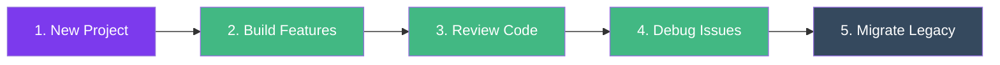
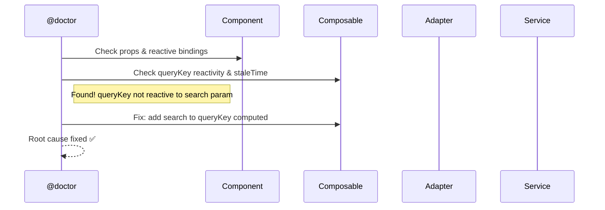

# Inicio Rapido

::: info Nota sobre Framework
Os exemplos abaixo utilizam os padroes do **pack Vue 3**. Cada framework pack (React, Next.js, SvelteKit) fornece padroes equivalentes adaptados ao seu ecossistema. Veja [Framework Packs](/pt-BR/guide/introduction#como-os-packs-funcionam) para detalhes.
:::

Apos [instalar](/pt-BR/guide/installation) o Specialist Agent, abra o Claude Code no seu projeto. Aqui estao os fluxos de trabalho mais comuns.



---

## 1. Iniciar um Novo Projeto

Use `@starter` para criar um projeto full-stack do zero — qualquer framework, backend e banco de dados.

```bash
"Use @starter to create a task-manager app with Vue + Express + PostgreSQL"
```

O assistente do starter pergunta sobre nome do projeto, stack frontend/backend, banco de dados, autenticacao e estrutura — e entao gera tudo incluindo Docker compose e README.

> **Saiba mais:** [Referencia do @starter](/pt-BR/reference/agents#starter-create-projects-from-scratch)

---

## 2. Construir um Modulo de Funcionalidade

Use `@builder` para criar modulos, componentes, servicos, composables ou testes. Ele le seu `ARCHITECTURE.md` e segue todas as convencoes automaticamente.

```bash
# Modulo completo com CRUD
"Use @builder to create a products module with CRUD for /v2/products"

# Componente individual
"Use @builder to create a ProductCard component with name, price, and image props"

# Apenas camada de servico
"Use @builder to create the service layer for /v3/orders"
```

Estrutura gerada:

```text
src/modules/products/
├── types/           ← Tipos da API + contratos do app
├── adapters/        ← Transformacao API ↔ App
├── services/        ← Chamadas HTTP puras
├── composables/     ← useProductsList, useProductDetail
├── components/      ← ProductsTable, ProductForm, ProductCard
├── views/           ← ProductsView
└── index.ts         ← Barrel export
```

> **Saiba mais:** [Construir um Modulo CRUD](/pt-BR/tutorials/crud-module) -- [Criar uma Camada de Servico](/pt-BR/tutorials/service-layer)

---

## 3. Revisar Antes do PR

Use `@reviewer` para validar o codigo em relacao a sua arquitetura antes de fazer merge.

```bash
# Revisao completa com verificacoes automatizadas
"Use @reviewer to review the products module"

# Verificacao rapida de arquitetura
/review-check-architecture products
```

Exemplo de saida:

```text
## Review — src/modules/products/

### Auto: tsc ✅ | ESLint ✅ | Build ✅ | Tests ✅

### 🟢 Compliant
  - services/products-service.ts: HTTP only, no try/catch ✅
  - adapters/products-adapter.ts: Pure functions, bidirectional ✅

## Verdict: ✅ Approved
```

> **Saiba mais:** [Referencia do @reviewer](/pt-BR/reference/agents#reviewer-review-analyze)

---

## 4. Depurar um Problema

Use `@doctor` para rastrear bugs atraves das camadas da arquitetura — do Component ate a API.

```bash
"Use @doctor to investigate why products aren't loading after search"
```



> **Saiba mais:** [Referencia do @doctor](/pt-BR/reference/agents#doctor-investigate-bugs)

---

## 5. Migrar Codigo Legado

Use `@migrator` para converter Options API para script setup, JS para TS ou modernizar modulos completos em 6 fases.

```bash
# Componente individual
"Use @migrator to convert OldProductsPage.vue to script setup"

# Modulo completo (6 fases com pontos de aprovacao)
"Use @migrator to migrate src/legacy/billing/ to the new architecture"
```

Antes → Depois:

```vue
<!-- Before: Options API -->
<script>
export default {
  data() { return { products: [], loading: false } },
  methods: { async fetchProducts() { ... } },
  mounted() { this.fetchProducts() }
}
</script>
```

```vue
<!-- After: Script Setup + Composable -->
<script setup lang="ts">
import { useProductsList } from '../composables/useProductsList'

const { items, isLoading } = useProductsList()
</script>
```

> **Saiba mais:** [Migre Seu Projeto](/pt-BR/tutorials/migrate-project)

---

## Referencia Rapida de Skills

Skills sao atalhos que voce invoca com `/skill-name`:

| Skill | O que faz |
|-------|-----------|
| `/dev-create-module [name]` | Scaffold completo de modulo |
| `/dev-create-component [name]` | Componente com script setup |
| `/dev-create-service [resource]` | Types + adapter + service |
| `/dev-create-composable [name]` | Composable com Vue Query |
| `/dev-create-test [file]` | Testes para qualquer arquivo |
| `/dev-generate-types [endpoint]` | Types a partir de endpoint/JSON |
| `/review-review [scope]` | Revisao completa de codigo |
| `/review-check-architecture [module]` | Conformidade com a arquitetura |
| `/review-fix-violations [module]` | Correcao automatica de violacoes |
| `/migration-migrate-component [file]` | Options → setup |
| `/migration-migrate-module [path]` | Migracao completa de modulo |
| `/docs-onboard [module]` | Visao geral do modulo em 2 minutos |

> **Saiba mais:** [Referencia de Skills](/pt-BR/reference/skills)

---

## Proximos Passos

- [Visao Geral da Arquitetura](/pt-BR/guide/architecture) — Entenda os padroes que seu codigo segue
- [Camadas](/pt-BR/guide/layers) — Mergulho profundo nas camadas Service, Adapter, Composable
- [Referencia de Agentes](/pt-BR/reference/agents) — Guia detalhado para cada agente
- [Referencia de Skills](/pt-BR/reference/skills) — Todas as skills disponiveis
- [Construir Formularios com Validacao](/pt-BR/tutorials/forms) — Zod + useMutation + tratamento de erros
- [Paginacao + Filtros](/pt-BR/tutorials/pagination-filters) — Listas com busca, filtros e paginacao
