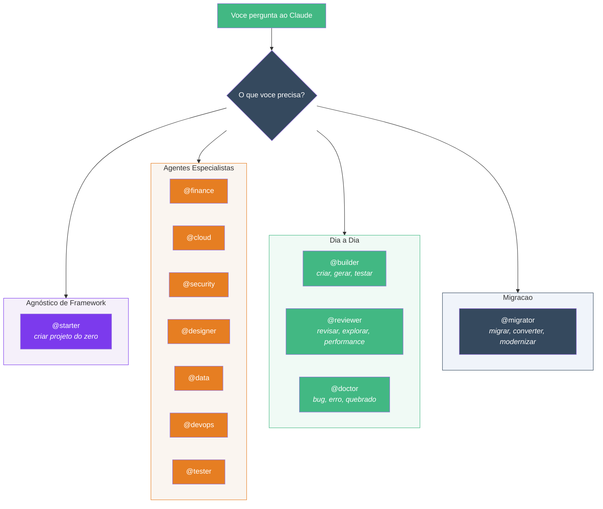
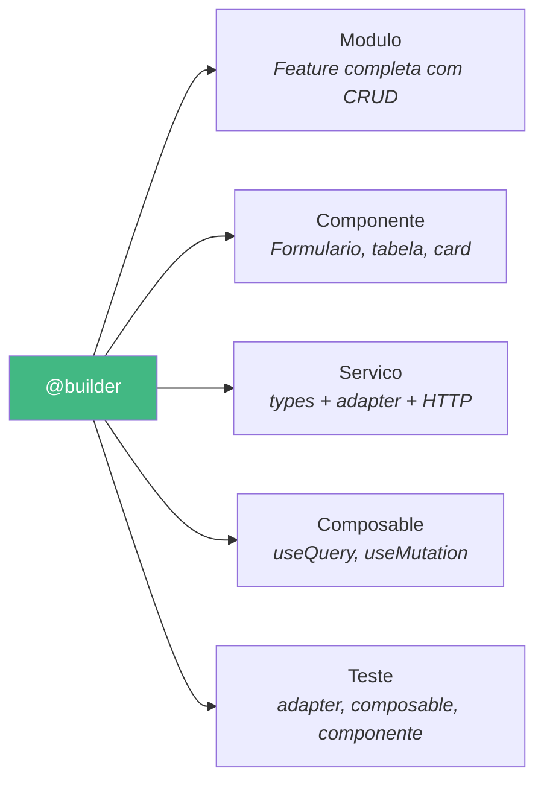
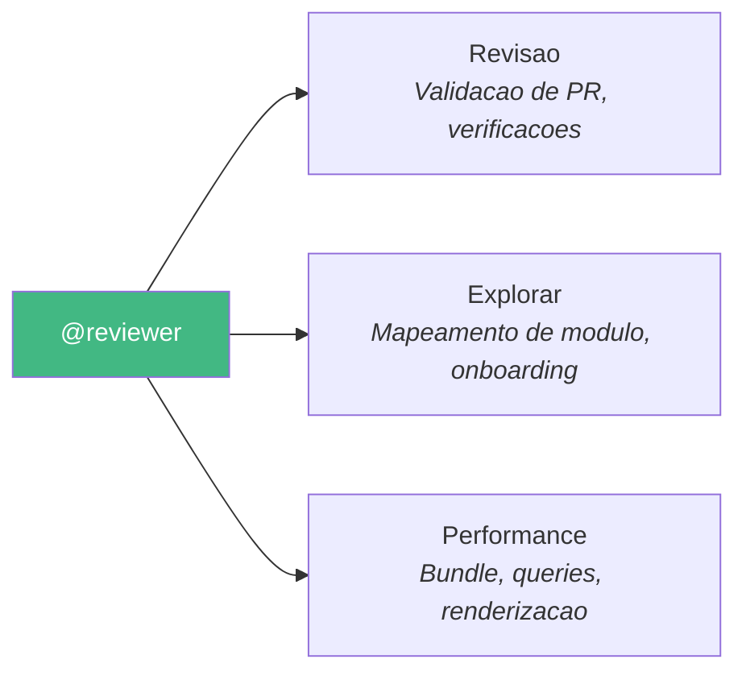
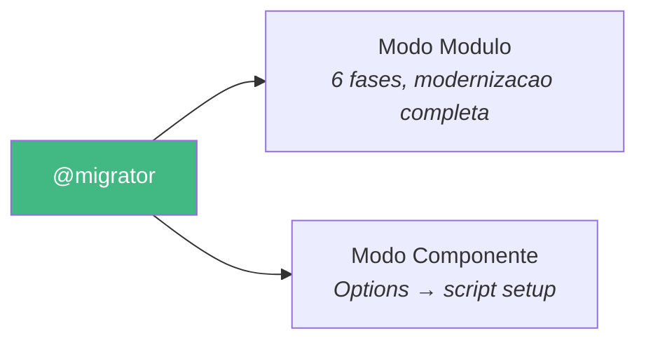
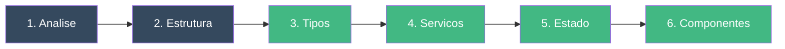
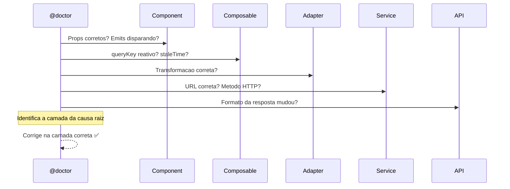

# Agentes

Agentes sao IAs especializadas para as quais o Claude delega automaticamente ou que voce invoca com `@nome`.

O Specialist Agent inclui **12 agentes** organizados em quatro categorias:



---

## Agente Agnostico de Framework

### @starter — Criar Projetos do Zero

**Quando usar:** Iniciar um novo projeto — qualquer framework frontend + qualquer backend + qualquer banco de dados.

```bash
# Vue + Express + PostgreSQL
"Use @starter to create an e-commerce app with Vue + Express + PostgreSQL"

# Vue + Fastify + MongoDB
"Use @starter to create a task-manager with Vue + Fastify + MongoDB"

# React (em breve)
"Use @starter to create a dashboard with React + Express + PostgreSQL"
```

O assistente de inicializacao pergunta sobre:
- **Nome do projeto** (kebab-case)
- **Frontend** — Vue 3, React
- **Backend** — Express, Fastify, FastAPI, Django, Gin, Fiber, Spring Boot
- **Banco de dados** — PostgreSQL, MySQL, MongoDB, SQLite
- **Autenticacao** — JWT, OAuth, Session
- **Estrutura** — Monorepo, diretorios separados, apenas frontend

Entao gera tudo: frontend + backend + configuracao do banco + Docker compose + README + git init.

---

## Agentes do Dia a Dia

Esses agentes sao para o **desenvolvimento cotidiano** — construir funcionalidades, revisar codigo e corrigir bugs.

### @builder — Construir Codigo Novo

**Quando usar:** Criar qualquer codigo novo — modulos, componentes, servicos, composables ou testes.



### Exemplos do mundo real

```bash
# E-commerce: gerar um modulo completo de produtos
"Use @builder to create a products module with CRUD for GET/POST/PATCH/DELETE /v2/products"

# Dashboard: criar um componente de grafico
"Use @builder to create a SalesChart component that receives data via props and uses Chart.js"

# Integracao de API: conectar a um novo endpoint
"Use @builder to create the service layer for /v3/orders with list, getById, and cancel"

# Testes: gerar testes para um adapter
"Use @builder to create tests for src/modules/products/adapters/products-adapter.ts"
```

### Fluxo do modo modulo

1. Pergunta: nome do recurso, endpoints, tipo de UI, necessidades de estado do cliente
2. Le `ARCHITECTURE.md` para convencoes
3. Gera `src/modules/[kebab-name]/` com todos os subdiretorios
4. Cria de baixo para cima: types → contracts → adapter → service → store → composables → components → view
5. Registra rota lazy, cria barrel export
6. Valida com `tsc --noEmit`

### Modo componente

- Posiciona em `src/modules/[feature]/components/` ou `src/shared/components/`
- `<script setup lang="ts">` com defineProps/defineEmits tipados
- < 200 linhas, sem prop drilling, trata estados de carregamento/erro/vazio

### Modo servico

Cria 4 arquivos:

- `.types.ts` — Tipos de resposta da API (snake_case)
- `.contracts.ts` — Contratos da aplicacao (camelCase)
- `-adapter.ts` — Parser bidirecional puro
- `-service.ts` — Apenas chamadas HTTP

### Modo composable

- **Query**: useQuery com queryKey reativo, staleTime, adapter
- **Mutation**: useMutation com invalidateQueries, adapter para payload
- **Logica compartilhada**: ref/computed com lifecycle hooks

### Modo teste

Prioridade: adapters (puros, faceis) > composables (mock do servico) > componentes (@vue/test-utils)

---

### @reviewer — Revisar e Analisar

**Quando usar:** Revisar alteracoes de codigo, explorar modulos, analisar performance.



### Exemplos do mundo real

```bash
# Antes de fazer merge de um PR
"Use @reviewer to review the changes in the payments module"

# Onboarding em um novo modulo
"Use @reviewer to explore src/modules/auth/ — I'm new to this codebase"

# Auditoria de performance
"Use @reviewer to check performance of the dashboard — it feels slow"
```

### Modo revisao

- Executa verificacoes automatizadas: `tsc`, `eslint`, `vitest`, `build`
- Verificacoes de padrao contra `ARCHITECTURE.md`
- Classificacao: 🔴 Violacao | 🟡 Atencao | 🟢 Conforme | ✨ Destaque
- **Veredito:** ✅ Aprovado | ⚠️ Com ressalvas | ❌ Requer alteracoes

### Modo explorar

- Inventaria arquivos por tipo (componentes, servicos, composables, stores)
- Detecta Options vs setup, JS vs TS, mixins, anti-patterns
- Mapeia dependencias (fan-in / fan-out)
- Relatorio somente leitura com fatos e numeros

### Modo performance

- Analise de tamanho do bundle via `vite build`
- Verificacao de lazy loading (rotas devem usar `() => import(...)`)
- Queries sem staleTime
- Watchers profundos, objetos inline no template
- Gargalos ordenados por impacto no usuario

::: tip Somente leitura
O reviewer nunca modifica arquivos. Ele sugere correcoes com trechos de codigo que voce pode aplicar.
:::

---

## Agentes de Migracao

Esses agentes sao para **modernizar projetos legados** — converter Options API para setup, JS para TS, Vuex para Pinia + Vue Query. Use `@reviewer` primeiro para diagnosticar o estado atual, depois `@migrator` para executar a migracao.

### @migrator — Modernizar Codigo Legado

**Quando usar:** Migrar Options API → script setup, JS → TS, ou modernizacao completa de modulo.



### Exemplos do mundo real

```bash
# Modernizar um modulo legado inteiro
"Use @migrator to migrate src/legacy/billing/ to the new architecture"

# Converter um unico componente
"Use @migrator to convert UserSettingsForm.vue from Options API to script setup"

# Migracao de JS para TypeScript
"Use @migrator to convert the auth module from JavaScript to TypeScript"
```

### Modo modulo (6 fases)



1. **Analise** — Mapear estado atual: contagem de arquivos, Options vs setup, JS vs TS, mixins
2. **Estrutura** — Criar diretorios alvo
3. **Tipos e Adapters** — .types.ts + .contracts.ts + adapter
4. **Servicos** — Extrair HTTP para servicos puros
5. **Estado** — Estado do servidor → Vue Query, estado do cliente → Pinia
6. **Componentes** — Converter para `<script setup lang="ts">`

A ordem e de baixo para cima. Aprovacao do usuario necessaria entre as fases.

### Modo componente — Tabela de conversao

| Options API | Script Setup |
|------------|--------------|
| `props` | `defineProps<T>()` |
| `emits` | `defineEmits<T>()` |
| `data()` | `ref()` / `reactive()` |
| `computed` | `computed()` |
| `methods` | Functions |
| `watch` | `watch()` / `watchEffect()` |
| Mixins | Composables |
| `this.$emit` | `emit()` |
| `this.$refs` | `useTemplateRef()` |

Decompoe se > 200 linhas. Atualiza consumidores se a API mudar.

---

### @doctor — Investigar Bugs

**Quando usar:** Investigar bugs, comportamento inesperado, erros no console, funcionalidades quebradas.

### Exemplos do mundo real

```bash
# Investigacao de erro de API
"Use @doctor to investigate the 500 error on the login page"

# Problema de dados desatualizados
"Use @doctor to find why the dashboard shows outdated data after saving"

# Componente nao renderizando
"Use @doctor to debug why the ProductCard isn't showing the price"
```

### Caminho de rastreamento (top-down)



Em cada camada, o doctor verifica:

| Camada | Verificacoes |
|--------|-------------|
| **Componente** | Props corretos? Emits disparando? Bindings reativos? |
| **Composable** | queryKey reativo? staleTime? Parametros do servico? Adapter aplicado? |
| **Adapter** | Transformacao correta? Campos faltando? Tipos errados? |
| **Servico** | URL correta? Metodo HTTP? Formato dos parametros? |
| **API** | Formato da resposta mudou? Campos adicionados/removidos? |

::: warning Apenas causa raiz
O doctor corrige na camada raiz, nunca trata sintomas. Se o bug esta no adapter, ele corrige o adapter — nao o componente.
:::

---

## Agentes Especialistas

Esses agentes sao **agnosticos de framework** — funcionam com qualquer stack e sao instalados junto com os agentes do seu pack.

### @finance — Sistemas Financeiros

**Quando usar:** Integracao de pagamento, cobranca, faturamento, calculo de impostos, relatorios financeiros.

```bash
# Integrar pagamentos Stripe
"Use @finance to add Stripe payment integration with one-time and subscription billing"

# Construir sistema de faturamento
"Use @finance to create an invoicing module with PDF export and tax calculations"

# Dashboard financeiro
"Use @finance to build a revenue reporting dashboard with MRR, churn, and LTV metrics"
```

**Modos:** Pagamento (integracao de provedor, fluxo de checkout) | Cobranca (assinaturas, faturas, rateio) | Relatorios (receita, livro-razao, dashboards)

**Regras principais:** Dinheiro como inteiros (centavos), pagamentos idempotentes, log de auditoria, nunca logar dados sensiveis.

---

### @cloud — Arquitetura em Nuvem

**Quando usar:** Servicos AWS/GCP/Azure, Infraestrutura como Codigo, serverless, containers, CI/CD.

```bash
# Infraestrutura Terraform
"Use @cloud to set up AWS infrastructure with Terraform: VPC, ECS, RDS, CloudFront"

# API Serverless
"Use @cloud to create a Lambda-based API with API Gateway and DynamoDB"

# Pipeline CI/CD
"Use @cloud to set up GitHub Actions with build, test, staging deploy, and production deploy"
```

**Modos:** Infraestrutura (IaC, rede, computacao, armazenamento) | Serverless (funcoes, gatilhos, eventos) | Pipeline (CI/CD, deploys, rollbacks)

**Regras principais:** Sempre usar IaC, criptografia por padrao, IAM com menor privilegio, nunca hardcodar credenciais.

---

### @security — Seguranca de Aplicacao

**Quando usar:** Autenticacao, autorizacao, conformidade OWASP, criptografia, RBAC/ABAC.

```bash
# Autenticacao JWT
"Use @security to implement JWT auth with refresh tokens, rate limiting, and account lockout"

# Controle de acesso baseado em funcao
"Use @security to add RBAC with admin, editor, and viewer roles"

# Auditoria de seguranca
"Use @security to audit the project for OWASP top 10 vulnerabilities"
```

**Modos:** Autenticacao (JWT, OAuth, session, MFA) | Autorizacao (RBAC, ABAC, ACL) | Hardening (varredura de vulnerabilidades, headers, validacao de entrada)

**Regras principais:** Nunca senhas em texto puro, tokens de curta duracao, validar no servidor, apenas queries parametrizadas.

---

### @designer — Implementacao de UI/UX

**Quando usar:** Design systems, layouts responsivos, acessibilidade (WCAG), animacoes, temas.

```bash
# Design system
"Use @designer to create a design token system with dark mode support"

# Layout responsivo
"Use @designer to build a dashboard layout with collapsible sidebar and responsive grid"

# Auditoria de acessibilidade
"Use @designer to audit the app for WCAG AA compliance and fix issues"
```

**Modos:** Design System (tokens, temas, componentes base) | Layout (responsivo, navegacao, grids) | Acessibilidade (WCAG, navegacao por teclado, leitores de tela)

**Regras principais:** Mobile-first, HTML semantico, WCAG AA minimo, CSS custom properties para temas.

---

### @data — Engenharia de Dados

**Quando usar:** Modelagem de banco de dados, migracoes, cache, pipelines ETL, otimizacao de queries.

```bash
# Schema do banco de dados
"Use @data to design the database schema for an e-commerce app with Prisma"

# Camada de cache
"Use @data to add Redis caching with cache-aside pattern for the products API"

# Otimizacao de queries
"Use @data to optimize slow queries in the dashboard module"
```

**Modos:** Modelagem (schema, migracoes, seeds, repositorios) | Cache (Redis, TTL, invalidacao) | Otimizacao (indices, EXPLAIN ANALYZE, connection pooling)

**Regras principais:** Sempre usar migracoes, chaves estrangeiras precisam de indices, medir antes de otimizar, nunca armazenar dados sensiveis sem criptografia.

---

### @devops — DevOps e Infraestrutura

**Quando usar:** Docker, Kubernetes, pipelines CI/CD, monitoramento, logging, automacao de infraestrutura.

```bash
# Setup Docker
"Use @devops to create a multi-stage Dockerfile and docker-compose for local development"

# Deploy Kubernetes
"Use @devops to create Kubernetes manifests with HPA, probes, and rolling updates"

# Stack de monitoramento
"Use @devops to set up structured logging and Prometheus metrics with Grafana dashboards"
```

**Modos:** Container (Docker, docker-compose, otimizacao) | Orquestracao (Kubernetes, Helm, service mesh) | Monitoramento (logging, metricas, alertas)

**Regras principais:** Containers nao-root, fixar versoes de imagens, limites de recursos no K8s, logs em JSON, todo alerta precisa de um runbook.

---

### @tester — Especialista em Testes

**Quando usar:** Estrategias de teste, suites de teste, analise de cobertura, infraestrutura de testes, padroes de mock.

```bash
# Estrategia de testes
"Use @tester to design a testing strategy for the project and identify coverage gaps"

# Criar suite de testes
"Use @tester to create comprehensive tests for src/modules/orders/"

# Testes E2E
"Use @tester to set up Playwright E2E tests for the authentication flow"
```

**Modos:** Estrategia (arquitetura de testes, piramide, convencoes) | Criacao de Testes (unitario, integracao, mocking) | E2E (Playwright/Cypress, Page Objects, integracao CI)

**Regras principais:** Testar comportamento nao implementacao, testes independentes, mock nos limites, dados de teste realistas, execucao rapida.

---

## Agentes Full vs Lite

Todos os 12 agentes possuem versoes Lite que usam `model: haiku` para menor custo.

| Aspecto | Full | Lite |
|---------|------|------|
| **Modelo** | Sonnet/Opus | Haiku |
| **Primeira acao** | Le ARCHITECTURE.md | Regras inline |
| **Validacao** | tsc, build, vitest | Ignorada |
| **Tamanho** | ~80-120 linhas | ~30-50 linhas |
| **Custo** | ~5-25k tokens | ~2-10k tokens |

Instale agentes lite com:

```bash
npx specialist-agent init    # selecione "Lite" no assistente
```

> **Quando usar Full vs Lite?**
> - **Full**: novos modulos, PRs, migracoes complexas, onboarding
> - **Lite**: scaffolding rapido, componentes simples, iteracoes rapidas
