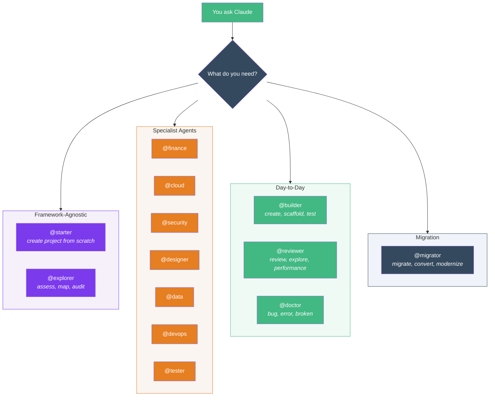
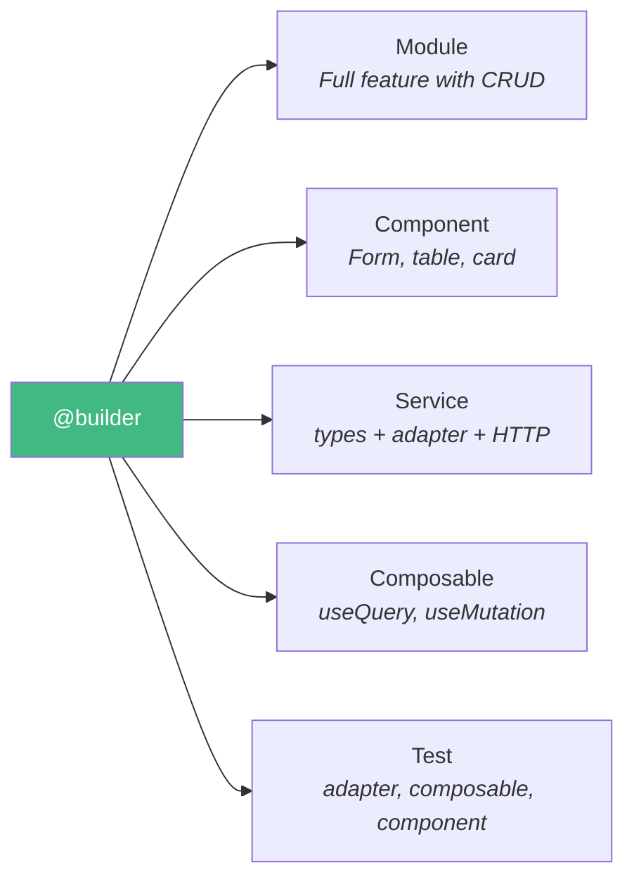
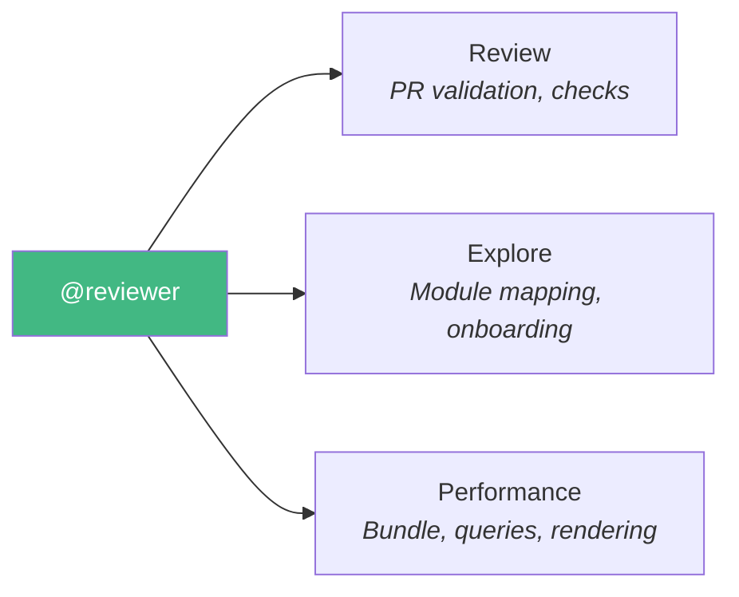
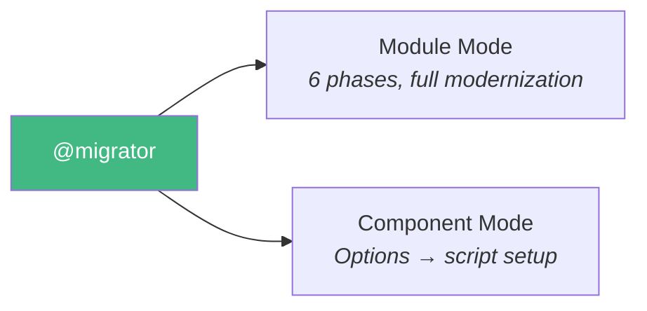
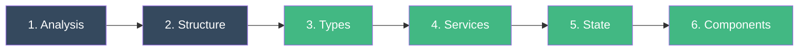
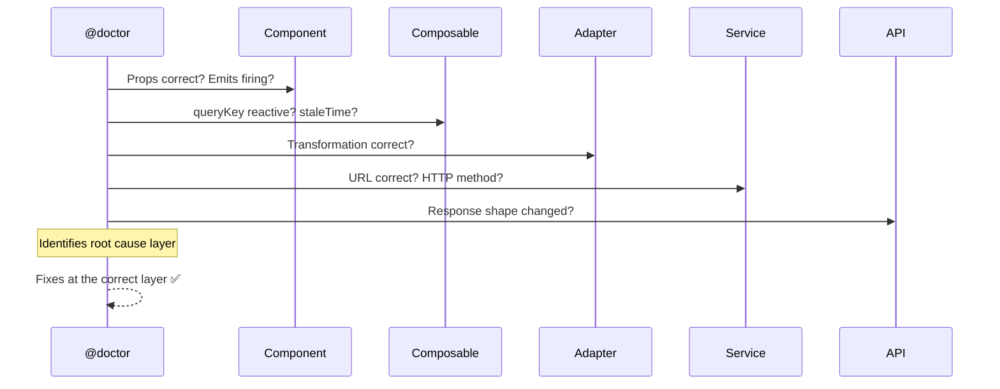

# Agents

Agents are specialized AIs that Claude delegates to automatically or that you invoke with `@name`.

Specialist Agent includes **13 agents** organized into five categories:



---

## Framework-Agnostic Agent

### @starter — Create Projects from Scratch

**When to use:** Start a new project — any frontend framework + any backend + any database.

```bash
# Vue + Express + PostgreSQL
"Use @starter to create an e-commerce app with Vue + Express + PostgreSQL"

# Vue + Fastify + MongoDB
"Use @starter to create a task-manager with Vue + Fastify + MongoDB"

# React (coming soon)
"Use @starter to create a dashboard with React + Express + PostgreSQL"
```

The starter wizard asks about:
- **Project name** (kebab-case)
- **Frontend** — Vue 3, React
- **Backend** — Express, Fastify, FastAPI, Django, Gin, Fiber, Spring Boot
- **Database** — PostgreSQL, MySQL, MongoDB, SQLite
- **Auth** — JWT, OAuth, Session
- **Structure** — Monorepo, separate dirs, frontend only

Then scaffolds everything: frontend + backend + database config + Docker compose + README + git init.

---

### @explorer — Assess & Map Codebases

**When to use:** Explore unfamiliar codebases, onboard on a new project, assess technical health, or audit dependencies.

```bash
# Full project assessment (new team member onboarding)
"Use @explorer to assess this project — I just joined the team"

# Map a specific module's structure
"Use @explorer to map the orders module and its dependencies"

# Audit dependencies for outdated or vulnerable packages
"Use @explorer to audit the project dependencies"
```

The explorer works in three modes:

**Assessment mode** — Full project health check:

- Surveys project structure, tech stack, and configuration
- Maps architecture layers and module boundaries
- Analyzes code quality patterns (TypeScript strictness, test coverage, linting)
- Produces a **Health Score (0–10)** with breakdown by dimension

**Module Map mode** — Deep-dive into a specific module:

- Inventories all files by type (components, services, composables, stores)
- Maps internal dependencies (fan-in / fan-out)
- Identifies coupling points with other modules
- Reports non-standard patterns or architecture deviations

**Dependency Audit mode** — Package analysis:

- Lists outdated packages with available updates
- Flags known vulnerabilities
- Identifies unused dependencies
- Reports bundle size impact of major packages

::: tip Read-only
The explorer never modifies files. It produces assessment reports with facts and actionable recommendations.
:::

---

## Day-to-Day Agents

These agents are for **everyday development** — building features, reviewing code, and fixing bugs.

### @builder — Build New Code

**When to use:** Create any new code — modules, components, services, composables, or tests.



### Real-world examples

```bash
# E-commerce: scaffold a full products module
"Use @builder to create a products module with CRUD for GET/POST/PATCH/DELETE /v2/products"

# Dashboard: create a chart component
"Use @builder to create a SalesChart component that receives data via props and uses Chart.js"

# API integration: connect to a new endpoint
"Use @builder to create the service layer for /v3/orders with list, getById, and cancel"

# Testing: generate tests for an adapter
"Use @builder to create tests for src/modules/products/adapters/products-adapter.ts"
```

### Module mode workflow

1. Asks: resource name, endpoints, UI type, client state needs
2. Reads `ARCHITECTURE.md` for conventions
3. Scaffolds `src/modules/[kebab-name]/` with all subdirectories
4. Creates bottom-up: types → contracts → adapter → service → store → composables → components → view
5. Registers lazy route, creates barrel export
6. Validates with `tsc --noEmit`

### Component mode

- Places in `src/modules/[feature]/components/` or `src/shared/components/`
- `<script setup lang="ts">` with typed defineProps/defineEmits
- < 200 lines, no prop drilling, handles loading/error/empty states

### Service mode

Creates 4 files:

- `.types.ts` — API response types (snake_case)
- `.contracts.ts` — App contracts (camelCase)
- `-adapter.ts` — Pure bidirectional parser
- `-service.ts` — HTTP calls only

### Composable mode

- **Query**: useQuery with reactive queryKey, staleTime, adapter
- **Mutation**: useMutation with invalidateQueries, adapter for payload
- **Shared logic**: ref/computed with lifecycle hooks

### Test mode

Priority: adapters (pure, easy) > composables (mock service) > components (@vue/test-utils)

---

### @reviewer — Review & Analyze

**When to use:** Review code changes, explore modules, analyze performance.



### Real-world examples

```bash
# Before merging a PR
"Use @reviewer to review the changes in the payments module"

# Onboarding on a new module
"Use @reviewer to explore src/modules/auth/ — I'm new to this codebase"

# Performance audit
"Use @reviewer to check performance of the dashboard — it feels slow"
```

### Review mode

- Runs automated checks: `tsc`, `eslint`, `vitest`, `build`
- Pattern checks against `ARCHITECTURE.md`
- Classification: 🔴 Violation | 🟡 Attention | 🟢 Compliant | ✨ Highlight
- **Verdict:** ✅ Approved | ⚠️ With caveats | ❌ Requires changes

### Explore mode

- Inventories files by type (components, services, composables, stores)
- Detects Options vs setup, JS vs TS, mixins, anti-patterns
- Maps dependencies (fan-in / fan-out)
- Read-only report with facts and numbers

### Performance mode

- Bundle size analysis via `vite build`
- Lazy loading verification (routes should use `() => import(...)`)
- Queries without staleTime
- Deep watchers, inline template objects
- Bottlenecks sorted by user impact

::: tip Read-only
The reviewer never modifies files. It suggests fixes with code snippets you can apply.
:::

---

## Migration Agents

These agents are for **modernizing legacy projects** — converting Options API to setup, JS to TS, Vuex to Pinia + Vue Query. Use `@reviewer` first to diagnose the current state, then `@migrator` to execute the migration.

### @migrator — Modernize Legacy Code

**When to use:** Migrate Options API → script setup, JS → TS, or full module modernization.



### Real-world examples

```bash
# Modernize an entire legacy module
"Use @migrator to migrate src/legacy/billing/ to the new architecture"

# Convert a single component
"Use @migrator to convert UserSettingsForm.vue from Options API to script setup"

# JS to TypeScript migration
"Use @migrator to convert the auth module from JavaScript to TypeScript"
```

### Module mode (6 phases)



1. **Analysis** — Map current state: file counts, Options vs setup, JS vs TS, mixins
2. **Structure** — Create target directories
3. **Types & Adapters** — .types.ts + .contracts.ts + adapter
4. **Services** — Extract HTTP to pure services
5. **State** — Server state → Vue Query, client state → Pinia
6. **Components** — Convert to `<script setup lang="ts">`

Order is bottom-up. User approval required between phases.

### Component mode — Conversion table

| Options API | Script Setup |
|------------|--------------|
| `props` | `defineProps<T>()` |
| `emits` | `defineEmits<T>()` |
| `data()` | `ref()` / `reactive()` |
| `computed` | `computed()` |
| `methods` | Functions |
| `watch` | `watch()` / `watchEffect()` |
| Mixins | Composables |
| `this.$emit` | `emit()` |
| `this.$refs` | `useTemplateRef()` |

Decomposes if > 200 lines. Updates consumers if API changes.

---

### @doctor — Investigate Bugs

**When to use:** Investigate bugs, unexpected behavior, console errors, broken features.

### Real-world examples

```bash
# API error investigation
"Use @doctor to investigate the 500 error on the login page"

# Stale data issue
"Use @doctor to find why the dashboard shows outdated data after saving"

# Component not rendering
"Use @doctor to debug why the ProductCard isn't showing the price"
```

### Trace path (top-down)



At each layer, the doctor checks:

| Layer | Checks |
|-------|--------|
| **Component** | Props correct? Emits firing? Reactive bindings? |
| **Composable** | queryKey reactive? staleTime? Service params? Adapter applied? |
| **Adapter** | Transformation correct? Missing fields? Wrong types? |
| **Service** | URL correct? HTTP method? Params format? |
| **API** | Response shape changed? Fields added/removed? |

::: warning Root cause only
The doctor fixes at the root layer, never patches symptoms. If a bug is in the adapter, it fixes the adapter — not the component.
:::

---

## Specialist Agents

These agents are **framework-agnostic** — they work with any stack and are installed alongside your pack agents.

### @finance — Financial Systems

**When to use:** Payment integration, billing, invoicing, tax calculation, financial reporting.

```bash
# Integrate Stripe payments
"Use @finance to add Stripe payment integration with one-time and subscription billing"

# Build invoicing system
"Use @finance to create an invoicing module with PDF export and tax calculations"

# Financial dashboard
"Use @finance to build a revenue reporting dashboard with MRR, churn, and LTV metrics"
```

**Modes:** Payment (provider integration, checkout flow) | Billing (subscriptions, invoices, proration) | Reporting (revenue, ledger, dashboards)

**Key rules:** Money as integers (cents), idempotent payments, audit logging, never log sensitive data.

---

### @cloud — Cloud Architecture

**When to use:** AWS/GCP/Azure services, Infrastructure as Code, serverless, containers, CI/CD.

```bash
# Terraform infrastructure
"Use @cloud to set up AWS infrastructure with Terraform: VPC, ECS, RDS, CloudFront"

# Serverless API
"Use @cloud to create a Lambda-based API with API Gateway and DynamoDB"

# CI/CD pipeline
"Use @cloud to set up GitHub Actions with build, test, staging deploy, and production deploy"
```

**Modes:** Infrastructure (IaC, networking, compute, storage) | Serverless (functions, triggers, events) | Pipeline (CI/CD, deployments, rollbacks)

**Key rules:** Always use IaC, encryption by default, least-privilege IAM, never hardcode credentials.

---

### @security — Application Security

**When to use:** Authentication, authorization, OWASP compliance, encryption, RBAC/ABAC.

```bash
# JWT authentication
"Use @security to implement JWT auth with refresh tokens, rate limiting, and account lockout"

# Role-based access
"Use @security to add RBAC with admin, editor, and viewer roles"

# Security audit
"Use @security to audit the project for OWASP top 10 vulnerabilities"
```

**Modes:** Authentication (JWT, OAuth, session, MFA) | Authorization (RBAC, ABAC, ACL) | Hardening (vulnerability scan, headers, input validation)

**Key rules:** Never plain-text passwords, short-lived tokens, validate server-side, parameterized queries only.

---

### @designer — UI/UX Implementation

**When to use:** Design systems, responsive layouts, accessibility (WCAG), animations, theming.

```bash
# Design system
"Use @designer to create a design token system with dark mode support"

# Responsive layout
"Use @designer to build a dashboard layout with collapsible sidebar and responsive grid"

# Accessibility audit
"Use @designer to audit the app for WCAG AA compliance and fix issues"
```

**Modes:** Design System (tokens, theming, base components) | Layout (responsive, navigation, grids) | Accessibility (WCAG, keyboard nav, screen readers)

**Key rules:** Mobile-first, semantic HTML, WCAG AA minimum, CSS custom properties for theming.

---

### @data — Data Engineering

**When to use:** Database modeling, migrations, caching, ETL pipelines, query optimization.

```bash
# Database schema
"Use @data to design the database schema for an e-commerce app with Prisma"

# Caching layer
"Use @data to add Redis caching with cache-aside pattern for the products API"

# Query optimization
"Use @data to optimize slow queries in the dashboard module"
```

**Modes:** Modeling (schema, migrations, seeds, repositories) | Caching (Redis, TTL, invalidation) | Optimization (indexes, EXPLAIN ANALYZE, connection pooling)

**Key rules:** Always use migrations, foreign keys need indexes, measure before optimizing, never store unencrypted sensitive data.

---

### @devops — DevOps & Infrastructure

**When to use:** Docker, Kubernetes, CI/CD pipelines, monitoring, logging, infrastructure automation.

```bash
# Docker setup
"Use @devops to create a multi-stage Dockerfile and docker-compose for local development"

# Kubernetes deployment
"Use @devops to create Kubernetes manifests with HPA, probes, and rolling updates"

# Monitoring stack
"Use @devops to set up structured logging and Prometheus metrics with Grafana dashboards"
```

**Modes:** Container (Docker, docker-compose, optimization) | Orchestration (Kubernetes, Helm, service mesh) | Monitoring (logging, metrics, alerting)

**Key rules:** Non-root containers, pin image versions, resource limits in K8s, JSON logs, every alert needs a runbook.

---

### @tester — Testing Specialist

**When to use:** Test strategies, test suites, coverage analysis, testing infrastructure, mocking patterns.

```bash
# Test strategy
"Use @tester to design a testing strategy for the project and identify coverage gaps"

# Create test suite
"Use @tester to create comprehensive tests for src/modules/orders/"

# E2E tests
"Use @tester to set up Playwright E2E tests for the authentication flow"
```

**Modes:** Strategy (test architecture, pyramid, conventions) | Test Creation (unit, integration, mocking) | E2E (Playwright/Cypress, Page Objects, CI integration)

**Key rules:** Test behavior not implementation, independent tests, mock at boundaries, realistic test data, fast execution.

---

## Agent Chaining — Handoff Protocol

Agents can recommend other agents when they detect work outside their scope. This is called the **Handoff Protocol** — each agent has rules for when to suggest delegation.

### Common chains

```text
@explorer → @reviewer → @migrator → @builder
  assess      diagnose     migrate     build new features
```

### Real-world scenarios

**New team member onboarding:**

```bash
# 1. Assess the project
"Use @explorer to assess this project"

# 2. Explorer suggests: "Security configuration needs attention → suggest @security"
"Use @security to audit the project for OWASP top 10 vulnerabilities"
```

**Building a new feature end-to-end:**

```bash
# 1. Design the database
"Use @data to design the schema for an orders module with Prisma"

# 2. Data suggests: "Schema ready → suggest @builder for the application layer"
"Use @builder to create the orders module with CRUD for /v2/orders"

# 3. Builder suggests: "Module created → suggest @tester for test coverage"
"Use @tester to create tests for src/modules/orders/"

# 4. Tester suggests: "Tests passing → suggest @reviewer for final check"
"Use @reviewer to review src/modules/orders/"
```

**Modernizing legacy code:**

```bash
# 1. Diagnose current state
"Use @reviewer to explore src/legacy/billing/"

# 2. Reviewer suggests: "Legacy patterns found → suggest @migrator"
"Use @migrator to migrate the billing module to modern architecture"

# 3. Migrator suggests: "Migration done → suggest @tester for validation"
"Use @tester to create tests for the migrated billing module"
```

::: tip Handoff is a suggestion, not automatic
Agents suggest the next agent — they don't auto-delegate. You decide whether to follow the recommendation or take a different path.
:::

---

## Full vs Lite Agents

All 13 agents have Lite versions that use `model: haiku` for lower cost.

| Aspect | Full | Lite |
|--------|------|------|
| **Model** | Sonnet/Opus | Haiku |
| **First action** | Reads ARCHITECTURE.md | Rules inline |
| **Validation** | tsc, build, vitest | Skipped |
| **Size** | ~80-120 lines | ~30-50 lines |
| **Cost** | ~5-25k tokens | ~2-10k tokens |

Install lite agents with:

```bash
npx specialist-agent init    # select "Lite" in wizard
```

> **When to use Full vs Lite?**
> - **Full**: new modules, PRs, complex migrations, onboarding
> - **Lite**: quick scaffolding, small components, rapid iterations
